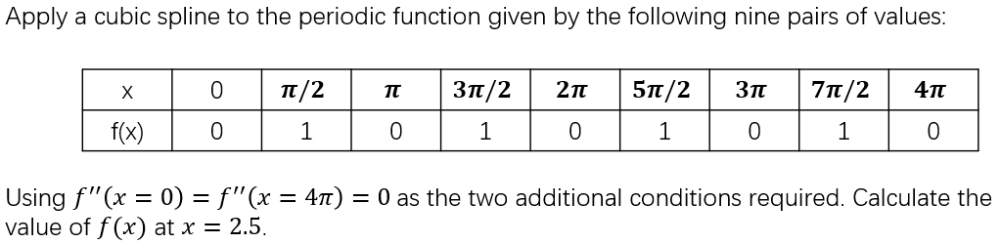

# Homework

**this part contains all the homework related information.**

Some homework are optional. If you submit the answer for the optional homework, maybe you could earn extra grades or maybe not. It partly depends on the grades you've got from the compulsory homework. But personally I recommend you to finish these optional ones because they may help you better understanding the course contents.

If you find some problems relating to the course contents are interesting and worth sharing, you are welcomed to tell me by email. It will be better to come up with new problems and solutions.

## 0. demo: Square root of complex number

1. **This is only a demo to show how to submit homework.**

2. Duedate: 20190913 00:00

3. Calculate the square root of a complex number using a function that could only calculate the square root of a real numbers.

4. Hints: this is too easy, so no hints.

## 1. Optimize the k prime number generator

1. Duedate: 20190928 00:00

2. We have finished the basic k prime number generator. From the lecture note, there are at least two aspects we could improve.

3. Understand and finish `code_template.m` and implement two improvements.

## 2. pi_Liu_Hui_method

1. Duedate: 20190928 00:00

2. Calculate the value of pi using Liu-Hui's method (the Ancient Chinese Method in lecture 1)

3. Additional reading material can be found on: [Liu Hui's method from Wiki]( https://en.wikipedia.org/wiki/Liu_Hui%27s_%CF%80_algorithm )

4. Understand and finish `code_template.m`.

5. You are asked to print both the number of polygon's sides `n` and the value of pi `pi` every time like what I displayed. Paste your output on the end your code with comment blocks.

## 3. Buffon_Needle_Method

1. Duedate: 20190928 00:00

2. calculate the pi using Buffon's Needle method. The related contents are on lecture note 1.

3. Understand and finish `code_template.m`.
## 4. Radioactive_decay_Problem

 

1. Duedate: 20190928 00:00

2. Finish the `code_template.m`, finish both the numerical differential equation result and the analytical representation result.  

3. Send me the figure comparing the results from both method via email.

## 5. pi_Monte_Carlo_integration

1. Due date: 20191019 00:00

2. Calculate pi using Monte Carlo Integration method, finish `code_template.m`.

## 6. Neville_interpolation

1. Due date: 20191019 00:00
   
2. Implement Neville interpolation method. Finish the `code_template.m`.
   
3. Hint: `lecture_note_3` gives you the procedure details.
   
## 7. cubic_spline_interpolation 

1. Due date: 20191019 00:00
   
2. Finish the `code_template.m`.

## 8. LU_linear_equation

1. Due time: 20191116 00:00
2. Given matrix A and vector b, solve the linaer equation ```Ax = b``` using LU decomposition method.
   * a: decompose matrix A into lower triangular matrix L and upper triangular matrix U, solve it manually, not just call the builtin function ```lu```.
   * b:solve triangular linear equations ```Ly = b```(solve it manually, don't use the builtin method ```L\b```).
   * c: solve the linear triangular linear equation ```Ux = y``` (solve it manually, don't use the builtin method ```U\y```).

3. The detail about how to implement LU decomposition is in 20191101 tutorial: [```20191101```](https://github.com/scarecrowyu/PHYS4150-2019/blob/master/Tutorial_material/20191101/20191101.pptx). If it's too hard to write LU decomposition program, you could use [```LU decomposition```](https://github.com/scarecrowyu/PHYS4150-2019/blob/master/Tutorial_material/20191101/LU.m), but you must understand it first.

## 9. Matrix_inversion

1. Due time: 20191116 00:00
2. Use Gauss-Jordan elimination to perform the matrix inversion.
3. Details can be found in  [```20191101```](https://github.com/scarecrowyu/PHYS4150-2019/blob/master/Tutorial_material/20191101/20191101.pptx) and ```lecture_note_5```.

## 10. QR_decomposition 

1. Due time: 20191116 00:00
2. Apply QR decomposition on tri-diagonal matrix. 
3. Details can be found in ```lecture_note_5```.